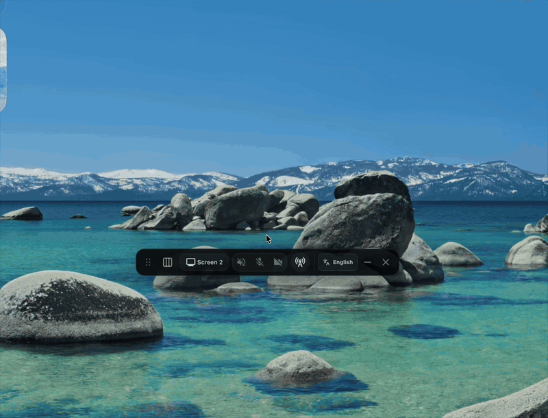

# OpenStream

OpenStream is a lightweight desktop livestreaming app for sending a selected screen or window to an RTMP/RTMPS destination like Youtube Live.



## Features

- Pick a screen or window as the live source.
- Stream to RTMP/RTMPS endpoints with a stream key.
- Create and stream to unlisted YouTube Live broadcasts after Google sign-in.
- Include system audio, microphone audio, and webcam video.
- Choose 16:9, 9:16, or 1:1 output presets.
- Arrange webcam layouts before going live.
- Runs as a compact floating Electron HUD.

## Development

```sh
npm install
npm run dev
```

### YouTube Live setup

YouTube Live creation uses the YouTube Data API and Google OAuth for desktop apps. OpenStream
requires a Google OAuth desktop client ID and client secret at build time. Users still sign in with
their own Google account.

For local development, set the values in your shell before starting the app:

```sh
export YOUTUBE_CLIENT_ID="your-google-oauth-client-id"
export YOUTUBE_CLIENT_SECRET="your-google-oauth-client-secret"
npm run dev
```

Local production builds require the same variables:

```sh
export YOUTUBE_CLIENT_ID="your-google-oauth-client-id"
export YOUTUBE_CLIENT_SECRET="your-google-oauth-client-secret"
npm run build
```

For GitHub Actions, store both values as repository secrets in
`Settings -> Secrets and variables -> Actions -> Repository secrets`:

- `YOUTUBE_CLIENT_ID`
- `YOUTUBE_CLIENT_SECRET`

The CI and release workflows pass these secrets to the build steps.

## Installation

Download the latest installer for your platform from the [GitHub Releases page](https://github.com/marcusschiesser/openstream/releases).

## Contributing

Contributions are welcome - please include screenshots or a short video for any UI change or new user-facing feature. If it touches what users see or do, show it. Skip only when it genuinely doesn't apply. PRs that don't follow this will be closed.

## Permissions

OpenStream needs screen capture permission to detect and stream screens or windows. Microphone and camera permissions are required only when those inputs are enabled.

## License

MIT
